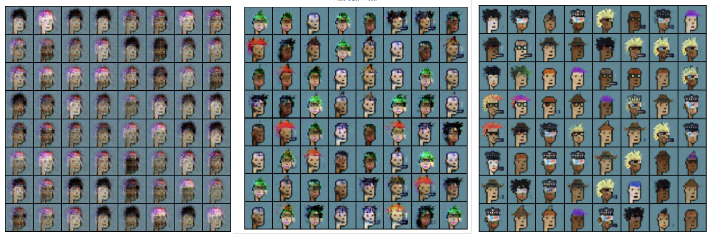

# Algovera: Generative AI for Art NFTs
Algovera is a community working to facilitate and accelerate the development of decentralised AI applications and research. The workflow and practices for machine learning engineers become quite different with recently-maturing technologies such as private AI, data marketplaces and Web3. The aim of this project is to go through the whole process of developing an AI algorithm with these new tools on the [Ocean Protocol](https://oceanprotocol.com/) infrastructure. We decided on the use case of generative models for art, since this is one of the few places that machine learning models are currently used in Web3. When finished, ownership and governance (e.g. of generated revenue) of the algorithm will be shared by the contributors. We run [hacking sessions](#-community) on Thursdays at 17:30 UTC where all are welcome to join and contribute.

# Contents

- [👪 Community](#-community)
- [🏗 Initial Setup](#-initial-setup)
- [🎨 Generative AI for Art on Web3](#-generative-ai-for-art-on-web3)
- [🤖 Resources](#-resources)
- [🏛 License](#-license)

# 👪 Community

## Hacking Sessions
- Algovera hacking sessions: Thursdays at 17:30 UTC. 60 min. [Zoom link](https://us02web.zoom.us/j/84985409109?pwd=WjhLYmRiRlN4a3F6SlE5czY0WUhjdz09), Meeting ID 849 8540 9109, Passcode 0PrKnWan. Anyone is welcome to drop in! 👋
- Catch up on previous sessions in the Hacking Sessions playlist of our [YouTube](https://www.youtube.com/playlist?list=PLgIrgqrkZC93qCxZFx_kWzk2vFdvgJjJI)
- Join the discussion in the #🖥-hacking-sessions channel of our [Discord](https://discord.gg/e65RuHSDS5)

## Algovera

Algovera is a community of individuals working to facilitate and accelerate the development of decentralised AI products and research.

[Website](https://www.algovera.ai/) | [Notion](https://algovera.notion.site/) | [Discord](https://discord.gg/e65RuHSDS5) | [Calendar](https://calendar.google.com/calendar/embed?src=c_4qajdfj4imie9cpnkbvkrc7ri4%40group.calendar.google.com) | [Twitter](https://twitter.com/AlgoveraAI) | [YouTube](https://www.youtube.com/channel/UC2A5iUpP6k52ZZmC8LFj1IA) |

# 🏗 Initial Setup 

## Set up environment

Open a new terminal and:
```console
#clone repo
git clone https://github.com/AlgoveraAI/generative-art.git
cd generative-art 

#create a virtual environment
python3 -m venv venv

#activate env
source venv/bin/activate

#Install the ocean.py library. Install wheel first to avoid errors.
pip install wheel
pip install ocean-lib

pip install gdown
```

# 🎨 Generative AI for Art on Web3

Many artists in Web3 use generative AI. This often involves re-training a model such as [StyleGAN2](https://github.com/NVlabs/stylegan2-ada-pytorch) on a dataset collected by the artist, and publishing the output images on a blockchain as NFTs. Experimenting with newly-collated datasets and training procedures is time-consuming and expensive, meaning that artists are highly protective of these assets. However, recent decentralized AI technologies may enable artists to monetize their datasets and models while maintaining control and privacy. Furthermore, interesting collaborations could take place between artists on different combintations of datasets and models (like a data union for artists). Rather than sharing a download link to data, the artist would permit another artist's algorithm to come to the location of their dataset and run some training code (Compute-to-Data), before returning the trained model. By publishing datasets and algorithms on the Ocean [marketplace](https://market.oceanprotocol.com/) , NFT enthusiasts could also buy or provide liquidity for the algorithm and data tokens (as well as buying the outputs of the models). This project will provide a Proof of Concept (PoC) for bringing generative models on-chain, and show artists that more value can be unlocked by publishing their models (and datasets) on Ocean.

# 🤖 Resources

Here are further resources.

- Training StyleGAN2 on Crypto Punks by [Holly](https://opensea.io/collection/neurapunks) and [Gene](https://twitter.com/genekogan/status/1384210326271369221)
- Training StyleGAN2 on satellite images by [Holly](https://hollygrimm.com/geomorphs)
- What are the benefits of [decentralized AI](https://a16z.com/2020/07/24/long-tail-problem-in-a-i/)?
- How do data science workers [collaborate](https://arxiv.org/abs/2001.06684)?

# 🏛 License

The license is MIT. [Details](LICENSE)
